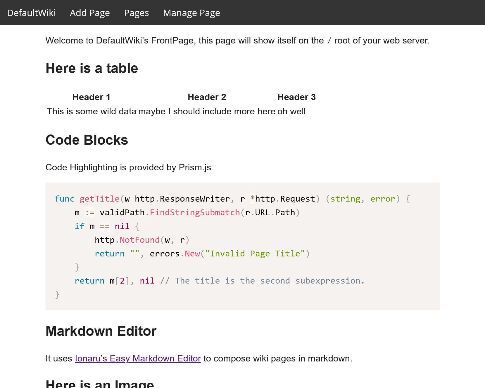
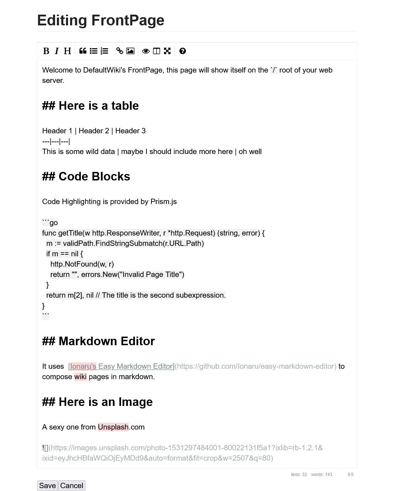
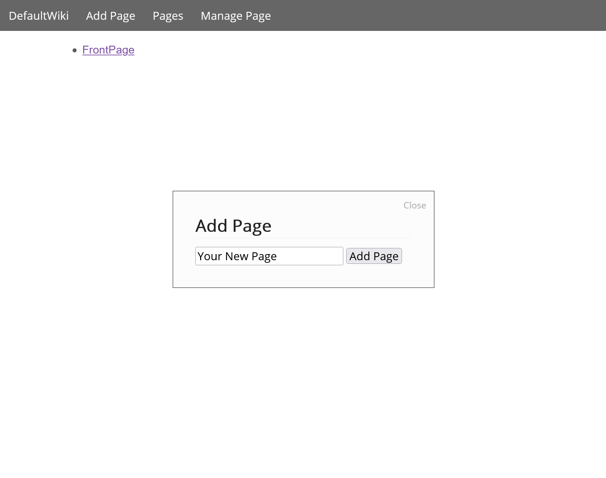
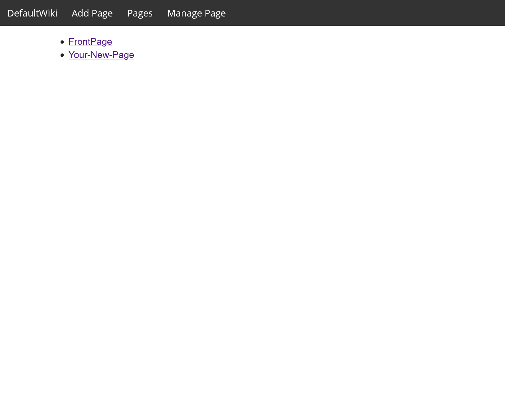

# DefaultWiki

Version: **0.5.2** - MVP

A simple flat-file, markdown-based, lightweight wiki software, meant for simple private instances.

## Features

1. Lists all pages currently stored under the `data/` folder.
2. Allows you to edit, view, delete these said pages.
3. Allows you to create new pages at will.
4. Any page on the wiki can be accessed using `/view/{PAGE_NAME}`. 
5. Uses EasyMDE to allow you to edit these wiki pages using markdown.

### Screenshots

## TODO: Build Instructions

There are a bunch of stuff that still needs to get done before I actually release a build.

## Who is this meant for?

Right now no one.

### Who is this Wiki going to be meant for?

People who just need a quick and dirty, but functional wiki software. Just to be able have documents shared between a group of trusted peers.

## Limitations

1. Requires files to in the folder that the `wiki.exe` is being run from.
2. Entirely file-based, speed is dependant on the I/O.
3. Wiki Looks okay. Could be better.
4. Markdown is limited to the Editor that I am using.
